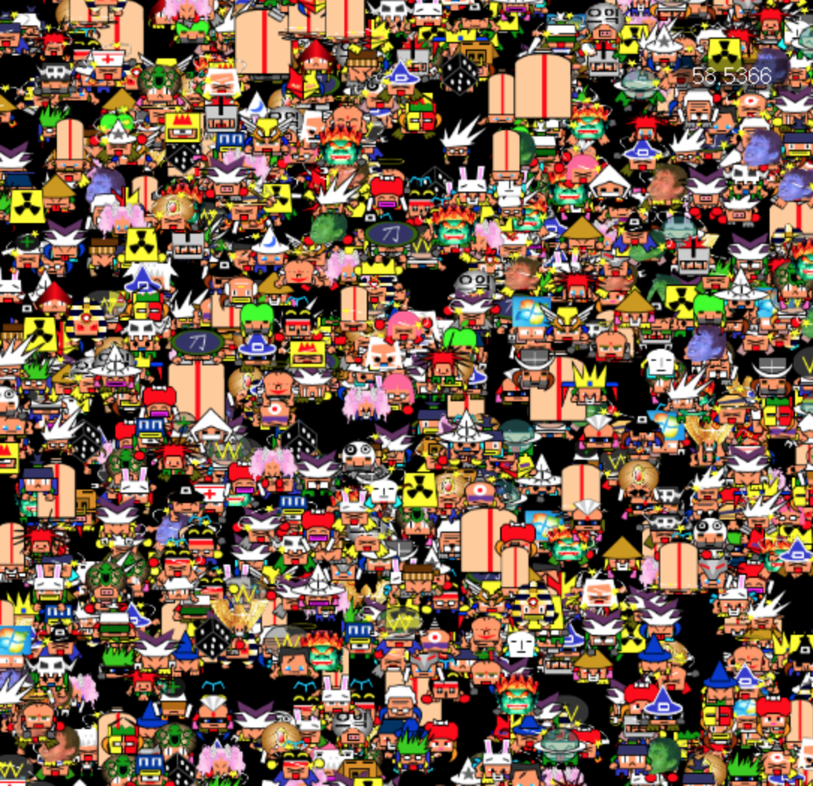
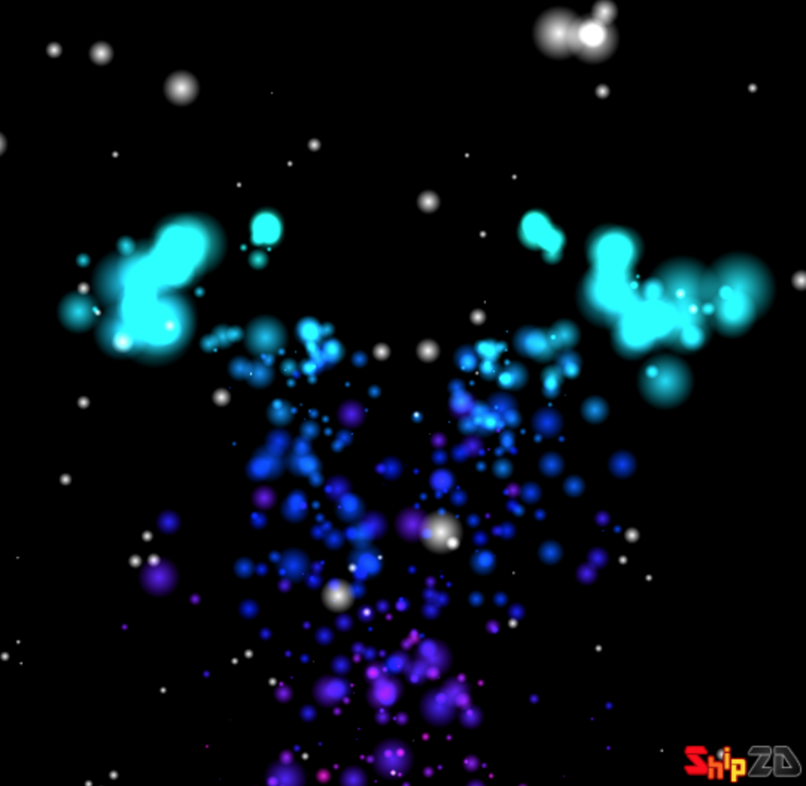
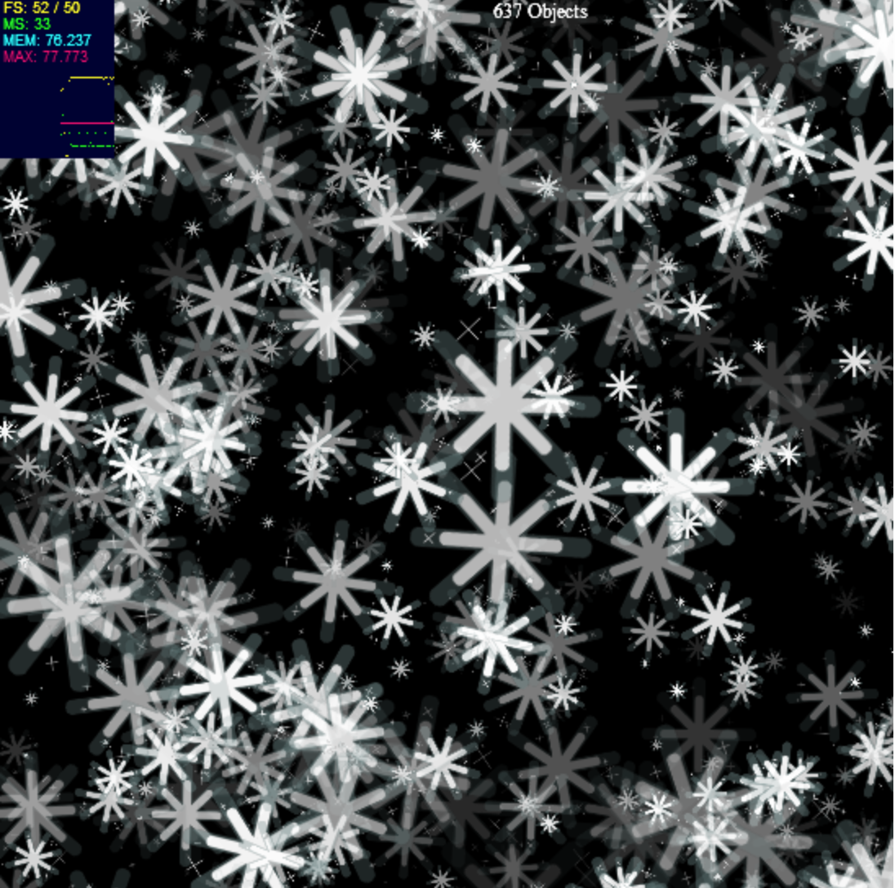
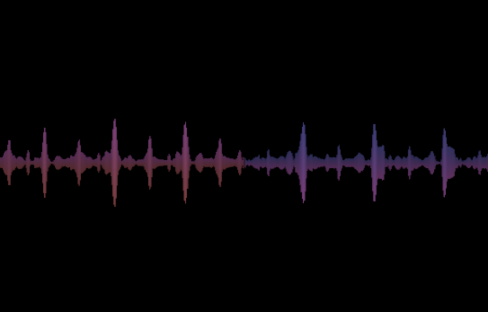

# ship2d Graphic Accelerator
>2D Image GPU Accelerator with Molehill, ActionScript3.0

## 구조
1. Ship2DContainer : 여기에 모든 객체를 addObject하여 사용합니다. 
2. Object2D : Ship2DContainer에 추가하여 사용할 수 있습니다.
3. Rectangle2D : 사각형 객체입니다. 여기에 텍스쳐를 입혀 시각화시켜주세요. Object2D를 상속합니다.
4. BitmapTexture : 가장 근본적인 텍스쳐. 비트맵데이터를 받아 만듭니다.
5. AnimationTexture : 텍스쳐 종류 중하나. 무비클립, 여러장의 비트맵데이터를 넣어 움직이는 텍스쳐를 만들 수 있습니다.
6. MovieClipStatus : 무비클립 사이즈 정보를 알때 씁니다. 엔진 사용시에 크게 쓸일 없습니다.
7. ObjectTexture : DisplayObject를 받아 텍스쳐로 사용합니다. 함수를 이용해 텍스쳐 정보를 다시 그려 업데이트 가능합니다.

## 이 라이브러리를 사용한 작품들
간단 작품
 - http://blog.shipnk.com/130123732561 (간단 시각화) - 소스 사용 불가
 - http://blog.shipnk.com/130124885260 (간단 파티클)

Ship2D 파티클 시각화
 - http://blog.shipnk.com/130124938471 (파티클 시각화) - 배경음악, 그릴 무비클립 필요
 - http://blog.shipnk.com/130124963244 (파티클 시각화 - 블렌드모드 수정)
 - http://blog.shipnk.com/130136126393 (막대 시각화)

플루톤님의 성능 테스트
 - http://blog.shipnk.com/130125012674 (플래시도타)

ObjectTexture로 무비클립을 텍스쳐로 사용
 - http://blog.shipnk.com/130123865333

AnimationTexture로 무비클립애니메이션, 비트맵데이터들을 재생
 - http://blog.shipnk.com/130124411707

